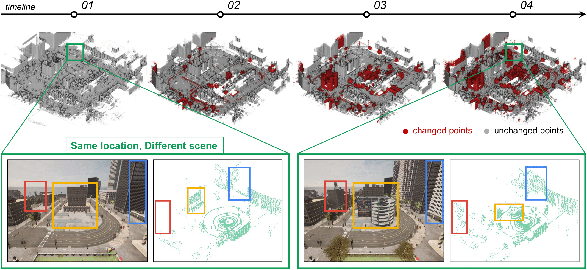
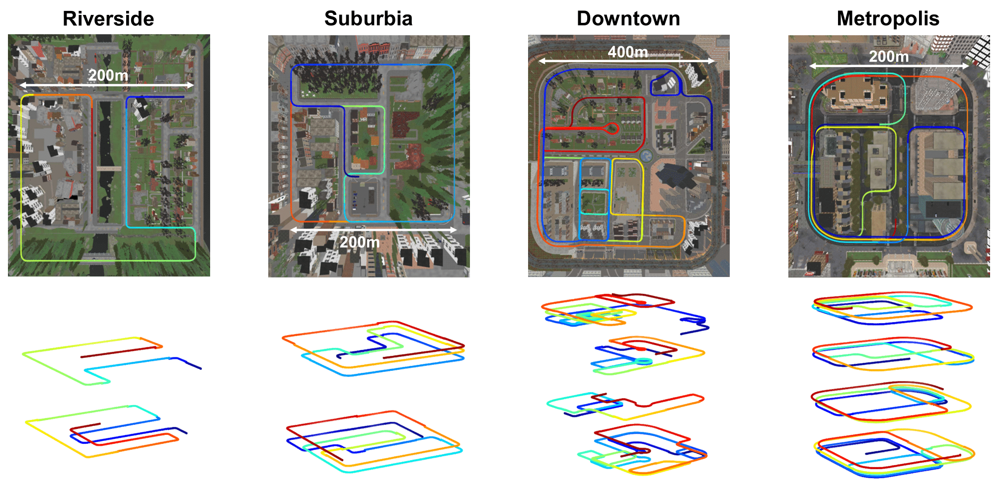

<h1 align="center"> The City that Never Settles<br/>: Simulation-based LiDAR Dataset <br/> for Long-Term Place Recognition <br/>Under Extreme Structural Changes </h1>
<!-- <p align="center">
<a href="https://tinyurl.com/DongjaeLEE0107"><strong>Dongjae LEE</strong></a>
·
<a href="https://minwoo0611.github.io/about/"><strong>Minwoo JUNG</strong></a>
·
<a href="https://ayoungk.github.io/"><strong>Ayoung KIM</strong></a>
</p> -->

<!-- <h3 align="center">IROS 2023 Workshop Paper</a> -->

<p></p>

<p align="center">

</p>

## Dataset

### CNS Dataset
We introduce CNS, a simulation-based dataset created using the CARLA simulator, capturing major structural changes—such as building construction and demolition—across diverse maps and sequences. We hope our dataset can catalyze further advances in long-term PR for real-world construction and demolition tasks.

### Sensor Configuration

<p align="center">
  
  <!--   -->
</p>

We configure the following virtual sensors in CARLA: a LiDAR and an IMU. Notably, we do not include a GNSS sensor because CARLA provides a built-in odometry message that already serves as a global ground-truth for vehicle poses. The simulation runs at 20Hz, with all sensor measurements synchronized at each frame.
- LiDAR
	- We employ a 32-channel LiDAR sensor, modeled after the *Ouster OS1* design, mounted on the roof of a simulated vehicle. The vertical field of view is set to cover ±22.5◦, with a maximum range of 120m. 
- IMU
	- We employ an IMU that provides ideal ground-truth inertial data—namely, zero bias and noise.

### Data Format
```
CNS
  │ transformation_lidar.yaml
  │ transformation_imu.yaml
  │
  └─Map
    └─Sequence
        │ gt.csv
        │ imu.csv
        │
        └─LiDAR
          TIME_STAMP.pcd
```
- LiDAR
	- LiDAR data is stored in **LiDAR** folder in pcd format (XYZI of each point). Each file is named by its timestamp.
	- For more detailed information, please refer to this <a href="https://carla.readthedocs.io/en/0.9.15/ref_sensors/#lidar-sensor">link</a>.
- IMU
	- **'imu.csv'** stores the orientation, angular velocity and linear acceleration data measured by IMU sensor.
	- [time_stamp, quaternion x, quaternion y, quaternion z, quaternion w, angular velocity x, angular velocity y, angular velocity z, linear acceleration x, linear acceleration y, linear acceleration z]	
- GT
  - The ground truth information can be found in the **'gt.csv'**.
  - [time_stamp, x, y, z, qx, qy, qz, qw]
- Transforamtion Data
	- The transforamtion matrix of the sensors are stored in **Transformation** folder.


## Sequences
<p float="center">
  
  <!--   -->
</p>
Our dataset comprises 4 maps and 12 sequences in total: <tt>Downtown</tt> and <tt>Metropolis</tt> each include 4 sequences <tt>(01–04)</tt>, while <tt>Riverside</tt> and <tt>Suburbia</tt> each contain 2 sequences <tt>(01–02)</tt>. Each sequence reflects a distinct stage of structural changes, where lower-numbered sequences represent maps with fewer structures, and higher-numbered sequences (e.g., <tt>04</tt> or <tt>02</tt>) represent the original, fully built environment. Thus, moving from lower to higher numbers simulates construction, and from higher to lower numbers simulates demolition.

- <tt>Riverside</tt>
  - Small residential area featuring a small river and several bridges. 
  - Originated from the Carla base map <a href="https://carla.readthedocs.io/en/0.9.15/map_town01/"><tt>Town01</tt></a>.

- <tt>Suburbia</tt>
  - Small town with a mix of residential and commercial zones, featuring numerous T-junctions. 
  - Originated from the Carla base map <a href="https://carla.readthedocs.io/en/0.9.15/map_town02/"><tt>Town02</tt></a>.

- <tt>Downtown</tt>
  - Large urban area with a variety of road types, including highways, multi-lane streets, and a central business district, offering a complex and diverse environment. 
  - Originated from the Carla base map <a href="https://carla.readthedocs.io/en/0.9.15/map_town03/"><tt>Town03</tt></a>.

- <tt>Metropolis</tt>
  - Urban area with a dense network of multi-lane roads, skyscrapers, and complex intersections, representing a highly developed and bustling city environment. 
  - Originated from the Carla base map <a href="https://carla.readthedocs.io/en/0.9.15/map_town10/"><tt>Town10</tt></a>.

## Download
<a href="https://drive.google.com/drive/folders/11HlqJziq6lDGVjYX8FdcVlmkA2EVDSsx?usp=sharing"><strong>Download Link</strong></a>

## Acknowledgements
This work is based on the CARLA Simulator. We would like to thank the CARLA team for their contributions and development of this powerful tool.

## Citation
If you use our dataset for your project, please cite our paper.
```

```

## License
The datasets are licensed under the terms of the MIT license. See the [LICENSE](LICENSE.md) file for license rights and limitations.